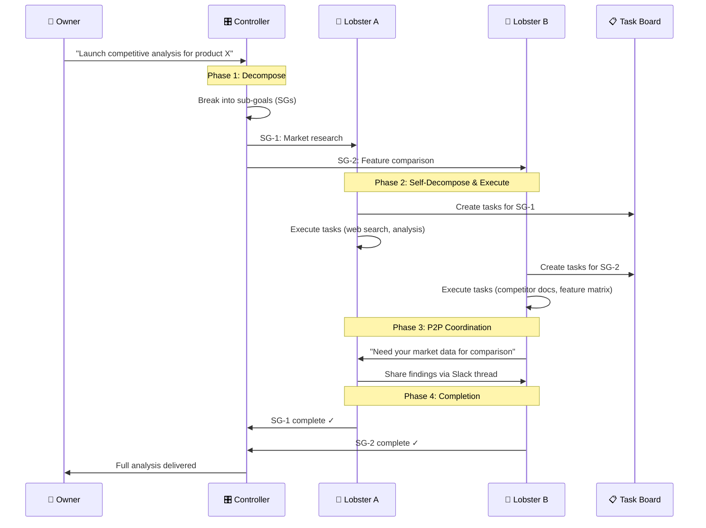
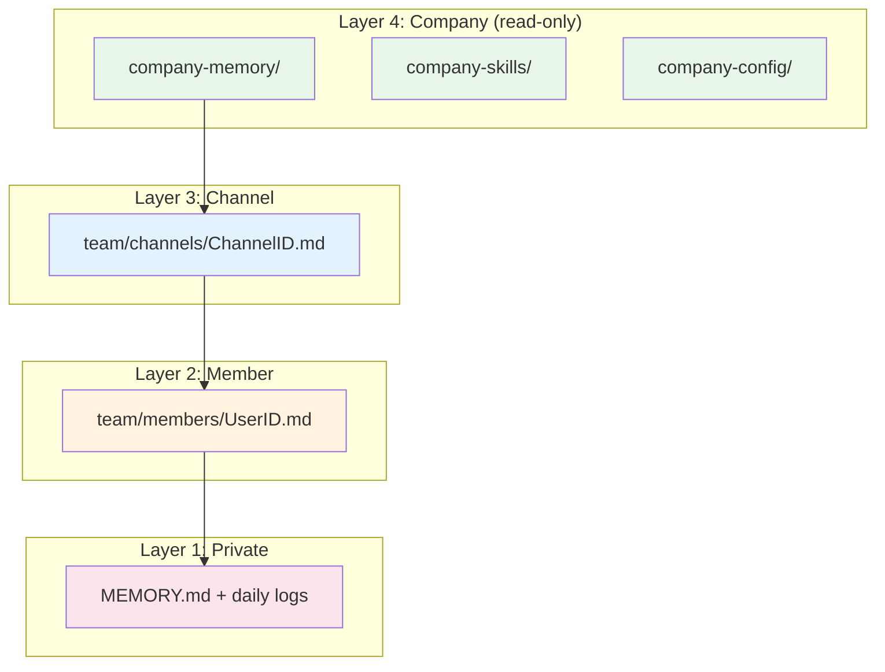
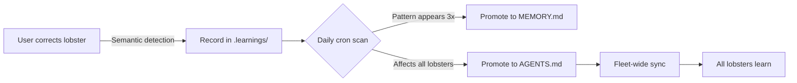
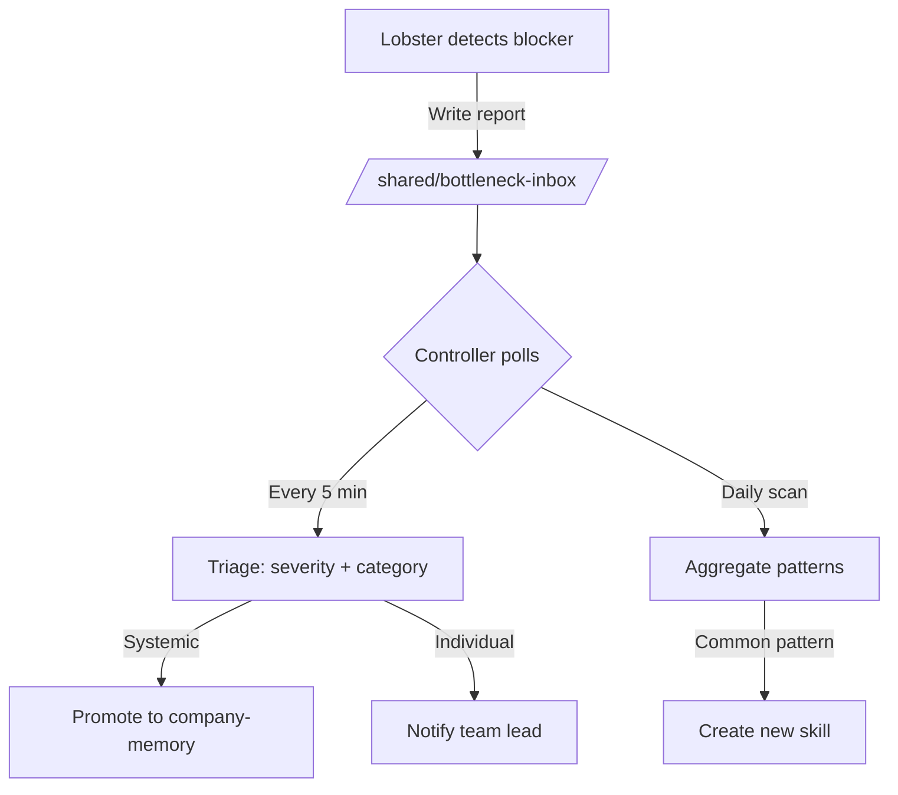

# Architecture

## Design Philosophy

Lobster Farm uses **Skill-based orchestration**. Skills are not configuration — they are the implementation. There is no separate "orchestration engine" because the orchestration logic lives in the skills themselves, executed by the OpenClaw runtime.

This is a deliberate design choice, not a gap:

- **Skills are executable specifications.** A skill like `goal-participant` contains the full protocol for receiving, decomposing, executing, and reporting on goals. The OpenClaw runtime interprets and executes these specifications with full tool access.
- **The runtime IS the engine.** OpenClaw provides the execution environment (tool calls, memory, sessions, cron, sub-agents). Lobster Farm provides the organizational layer (what to do, when, and how to coordinate).
- **Analogy:** Kubernetes doesn't have a "deployment engine" binary — it has YAML specs and a runtime that interprets them. Lobster Farm follows the same pattern: declarative skill specs + capable runtime.

## System Layers

```
┌─────────────────────────────────────────────┐
│  Layer 4: Governance & Skills               │
│  AGENTS.md, manifest.json, 17 skills        │
│  → Defines behavior, protocols, permissions │
├─────────────────────────────────────────────┤
│  Layer 3: Fleet Operations                  │
│  24 shell scripts + Teamind (Node.js)       │
│  → Spawn, sync, upgrade, monitor, backup    │
├─────────────────────────────────────────────┤
│  Layer 2: Container Isolation               │
│  Docker + bind mounts + secrets             │
│  → Per-lobster isolation with shared reads  │
├─────────────────────────────────────────────┤
│  Layer 1: OpenClaw Runtime                  │
│  Gateway, sessions, tools, cron, ACP        │
│  → Execution engine for each lobster        │
└─────────────────────────────────────────────┘
```

**Lobster Farm owns Layers 2–4. Layer 1 (OpenClaw) is the upstream dependency.**

## GoalOps: How Goals Become Results



**Key insight:** The Controller doesn't micromanage. It decomposes and delegates. Lobsters self-organize, coordinate peer-to-peer, and report back. The `goal-participant` skill defines the complete protocol each lobster follows.

## Memory Architecture



**Information flows downward only.** Company knowledge is visible to all. Private memory is visible only to the owner and their lobster. Promoting information upward (private → shared) requires explicit action.

## Self-Improving Loop



The correction detection is **semantic, not keyword-based**. A lobster recognizes corrections from context: direct negation, alternative answers, gentle guidance, demonstrations, or even the user giving up ("forget it, I'll do it myself" — a strong failure signal).

## Bottleneck Detection Flow



## Why Shell Scripts?

Fleet management is fundamentally about orchestrating Docker, files, and APIs on a host machine. Shell is the natural language for this:

- **Direct Docker/system access** — no abstraction layer needed
- **Composable** — pipe, grep, jq work out of the box
- **Auditable** — every script is readable, greppable, diffable
- **No build step** — clone and run
- **Battle-tested patterns** — `set -euo pipefail`, `--dry-run`, `--verbose`, `--json` output

The Node.js modules (Teamind) are used where they should be: async I/O, embeddings, database access.

## FAQ

**Q: Why does Corellis depend on OpenClaw instead of being standalone?**
A: OpenClaw provides the AI runtime (LLM sessions, tool execution, cron, sub-agents). Reimplementing this would be wasteful. Lobster Farm adds the fleet layer: multi-agent coordination, shared memory, governance, and operational tooling. This is the same relationship as "Helm depends on Kubernetes."

**Q: Can I use this without Slack?**
A: Teamind and some broadcast scripts require Slack. The core fleet management (spawn, health-check, upgrade, backup) works with any OpenClaw-supported channel. Skill-based features (GoalOps, self-improving) are channel-agnostic.

**Q: How does this compare to other multi-agent frameworks (CrewAI, AutoGen, etc.)?**
A: Most multi-agent frameworks focus on task-level orchestration (chain agents for a single task). Lobster Farm operates at the organizational level: persistent agents with memory, identity, and relationships, running 24/7. See [Alternatives](#alternatives) in README for a detailed comparison.
