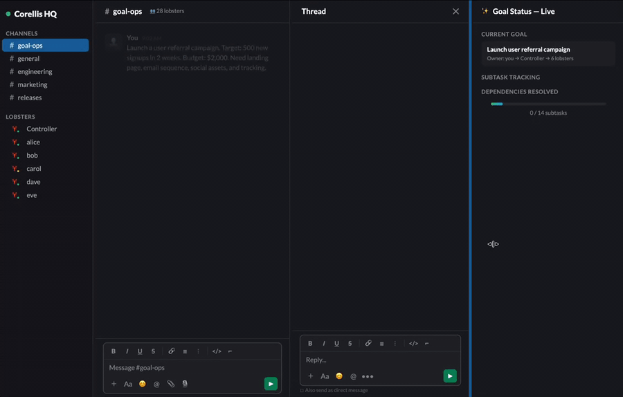

# 🦞 Lobster Farm

**Scale your [OpenClaw](https://openclaw.ai) from one AI assistant to a fleet — one per team member, with shared knowledge and collective memory.**

[OpenClaw](https://openclaw.ai) is an open-source personal AI assistant. Lobster Farm lets you give that same experience to your entire team: each person gets their own isolated "lobster" in a Docker container, with private memory and conversations, while sharing company knowledge, skills, and a searchable team memory across the fleet.

<p align="center">
  
</p>

> Production-tested with 21 lobsters on a single server.

## What Lobster Farm Adds to OpenClaw

| Just OpenClaw | OpenClaw + Lobster Farm |
|---|---|
| 1 AI assistant for you | 1 AI assistant **per team member** |
| Your personal memory | **4-layer memory**: personal → member → channel → company |
| You know what you discussed | **Teamind**: everyone can search all team discussions |
| You learn from your mistakes | **Fleet learning**: one lobster's lesson promotes to all |
| Manual setup per person | **One command** to spawn, fleet-wide sync and upgrades |

## Features

Your agents proactively find work, learn from mistakes, coordinate as a team, and never lose context. See **[docs/use-cases.md](docs/use-cases.md)** for real-world scenarios.

### Core Intelligence
- 🧠 **Teamind** — Collective team memory: semantic search across all Slack conversations, thread summaries, daily digests
- 🧬 **Self-Improving (2nd Me)** — Lobsters auto-learn from corrections, errors, and reflections — lessons persist across sessions and promote fleet-wide
- 🎯 **GoalOps** — Distributed goal coordination: controller decomposes goals into sub-goals, lobsters self-decompose into tasks, P2P collaboration across the fleet
- 🔒 **4-layer memory** — Owner private → member personal → channel → shared company knowledge

### Workflow & Automation
- ✅ **Approval flow** — Generic approval framework: send proposals to Slack, parse human decisions, callback execution
- 📋 **Task management** — Unified task board: sprint planning, breakdown, CRUD, proactive scanning, TODO extraction. Backend-agnostic (Notion, Linear, GitHub Projects, or markdown)

### Infrastructure & Operations
- 🐣 **30-second spawning** — Tell your controller "spawn lobster alice" — it handles Slack app creation, OAuth, and container setup. You just click Allow and paste one token
- 📦 **Skill tiers** — base / restricted / admin skill access control with manifest.json
- 🔍 **Bottleneck detection** — Lobsters proactively identify blockers and report to controller
- 📚 **Shared knowledge** — Peer-to-peer learning across the fleet
- 🔄 **Fleet ops** — Broadcast, sync, rolling upgrade with canary + auto-rollback
- 🐕 **Watchdogs** — Auto-rollback config changes and restart unhealthy gateways
- 🤖 **ACP / Claude Code** — Built-in coding agent support via acpx plugin

### 17 Built-in Skills
Includes ready-to-use skills: deep research, structured decision alignment, Excalidraw diagrams, Google Workspace, GitHub CLI, quick data dashboards, and more. See [`templates/skills/`](templates/skills/) for the full list.
- 🩹 **Patch system** — Fix known OpenClaw issues with one command

## Quick Start

> **Deployment model**: The controller (your OpenClaw) runs directly on the host machine. Each team member's lobster runs in its own Docker container. The controller manages containers and owns the shared directories; lobsters mount them read-only.

1. Install [OpenClaw](https://openclaw.ai) on your host machine (the controller):
   ```bash
   npm install -g openclaw
   ```
2. Clone this repo and configure:
   ```bash
   git clone https://github.com/CorellisOrg/corellis.git
   cd corellis
   cp .env.example .env   # fill in your LLM API key(s)
   ```
3. Build the lobster Docker image:
   ```bash
   docker build -f docker/Dockerfile.lite -t lobster-openclaw:latest .
   ```
4. Spawn your first lobster (tell your controller, or use the CLI):
   ```
   # Via natural language (recommended):
   # Tell your controller: "Spawn a new lobster called alice for @username"
   # It will create the Slack app, guide you through OAuth, and launch the container.

   # Or via CLI:
   ./scripts/create-slack-app.sh alice        # Creates Slack app automatically
   ./scripts/spawn-lobster.sh alice U0XXXXXXXXX xoxb-xxx xapp-xxx
   ```
5. Apply patches (recommended):
   ```bash
   ./scripts/patch-all.sh
   ```

## Architecture

<details>
<summary>Controller on host + lobsters in Docker containers (click to expand)</summary>

The **controller** runs directly on the host (not in Docker). It needs host access to manage Docker containers and write to shared directories. Each **lobster** runs in an isolated Docker container with read-only access to shared knowledge.

```
┌─────────────────────────────────────────────────┐
│  Host Machine                                    │
│                                                  │
│  🎛️ Controller (OpenClaw on host)                │
│  ├── Manages Docker containers                   │
│  ├── Writes company-skills/, company-memory/     │
│  └── Runs spawn, broadcast, sync, health-check   │
│                                                  │
│  ┌──────────┐ ┌──────────┐ ┌──────────┐        │
│  │ 🦞 alice │ │ 🦞 bob   │ │ 🦞 carol │        │
│  │ (Docker) │ │ (Docker) │ │ (Docker) │        │
│  └────┬─────┘ └────┬─────┘ └────┬─────┘        │
│       │             │             │              │
│  ┌────┴─────────────┴─────────────┴────┐        │
│  │  Shared Volumes (bind mount, ro)    │        │
│  │  company-memory/ company-skills/    │        │
│  │  company-config/ shared-knowledge   │        │
│  └─────────────────────────────────────┘        │
│                                                  │
│  Each lobster also has private rw storage:       │
│  configs/<name>/workspace/ → ~/.openclaw/        │
└─────────────────────────────────────────────────┘
```

**Why not Docker for the controller?** The controller needs to run `docker compose`, manage host files, and execute fleet scripts. Putting it in Docker would require Docker-in-Docker or socket mounting — added complexity with no benefit. Most users already have OpenClaw on their machine; Lobster Farm extends it.

</details>

## Directory Structure

<details>
<summary>Full project tree (click to expand)</summary>

```
corellis/
├── docker/
│   ├── Dockerfile.lite        # Recommended: OpenClaw + Chrome + VNC + ACP (~1.5GB)
│   ├── entrypoint.sh          # Container entrypoint (dbus fix, skill sync)
│   └── entrypoint.sh          # Legacy entrypoint (v1)
├── scripts/
│   ├── create-slack-app.sh    # Auto-create Slack bot via Manifest API
│   ├── spawn-lobster.sh       # Create new lobster
│   ├── health-check.sh        # 4-point health check + auto-fix
│   ├── rolling-upgrade.sh     # Canary → batch → auto-rollback
│   ├── broadcast.sh           # AI-mediated broadcast
│   ├── broadcast-direct.sh    # Direct Slack API broadcast
│   ├── apply-fleet-config.sh  # Push config patches to all lobsters
│   ├── sync-fleet.sh          # Sync skills, memory, keys
│   ├── sync-company-skills.sh # Symlink shared skills into lobster workspaces
│   ├── credential-healthcheck.sh  # Verify all lobster credentials
│   ├── config-watchdog.sh     # Dead-man switch for config changes
│   ├── gateway-watchdog.sh    # Auto-restart unhealthy gateways
│   ├── enable-acp.sh          # Enable Claude Code on a lobster
│   ├── patch-all.sh           # Apply all OpenClaw patches
│   ├── run-2nd-me-scan.sh     # Trigger self-improvement scan
│   ├── trigger-2nd-me-all.sh  # Run 2nd Me scan on all lobsters
│   └── teamind/               # 🧠 Group chat memory system
│       ├── setup.js           # Initialize SQLite database
│       ├── indexer.js          # Fetch & embed Slack messages
│       ├── search.js          # Semantic search
│       └── digest.js          # Per-lobster daily digest
├── templates/
│   ├── company-config/        # 🏛️ Governance templates
│   │   ├── AGENTS.md          # Company-wide lobster rules
│   │   ├── REGISTRY.md        # Resource index
│   │   ├── DIRECTORY.md       # Path/permission mapping
│   │   └── PLAYBOOK-SPEC.md   # Playbook specification
│   ├── company-memory/        # 📚 Knowledge base templates
│   │   ├── INDEX.md           # Knowledge index template
│   │   └── SPEC.md            # Document standards
│   ├── skills/                # 🧩 22 built-in skills
│   │   ├── approval-flow/     # Generic approval workflows
│   │   ├── goal-participant/  # GoalOps participant protocol
│   │   ├── task-management/   # Unified task board (backend-agnostic)
│   │   ├── deep-research/     # Multi-model research
│   │   └── ...                # 16 more skills
│   ├── manifest.json          # Skill registry (25 skills)
│   ├── SKILL_POLICY.md        # Skill tier documentation
│   ├── teamind/SKILL.md       # Teamind skill for lobsters
│   ├── self-improving/SKILL.md
│   ├── bottleneck-reporting/SKILL.md
│   └── shared-knowledge/
├── docs/
│   ├── tutorial-3-person-team.md  # End-to-end walkthrough
│   ├── capabilities.md            # Complete feature reference
│   ├── slack-bot-setup.md         # Slack bot creation guide
│   └── guides/                    # 📖 7 operational guides
│       ├── 2nd-me-setup.md        # Self-improvement system setup
│       ├── acp-session.md         # Claude Code session management
│       ├── confidence-assessment.md # Task confidence scoring
│       ├── github-setup.md        # GitHub token setup
│       ├── owner-context-mining.md # Learning about your owner
│       ├── secretref-usage.md     # Credential management
│       └── skill-audit-guide.md   # Security audit guide
├── .env.example
└── docker-compose.yml         # Auto-managed by spawn script
```

</details>

## Scripts

<details>
<summary>24 operational scripts — spawning, fleet sync, health checks, upgrades (click to expand)</summary>

### Core Operations
| Script | Description |
|--------|-------------|
| `create-slack-app.sh` | Auto-create Slack App via Manifest API (no manual clicking) |
| `spawn-lobster.sh` | Create a new lobster container (auto or after create-slack-app) |
| `health-check.sh` | Check gateway, Slack, disk, memory for all lobsters |
| `rolling-upgrade.sh` | Upgrade image with canary testing and auto-rollback |
| `backup-lobsters.sh` | Backup all lobster configs and workspaces |

### Fleet Management
| Script | Description |
|--------|-------------|
| `apply-fleet-config.sh` | Deep-merge a JSON patch into all lobster configs |
| `sync-fleet.sh` | Push skills, memory, and API keys to all lobsters |
| `broadcast.sh` | Send message via AI session (lobster reformulates) |
| `broadcast-direct.sh` | Send message via Slack API (100% reliable) |

### Maintenance
| Script | Description |
|--------|-------------|
| `config-watchdog.sh` | Dead-man switch: auto-rollback if not cancelled in N seconds |
| `gateway-watchdog.sh` | Cron job: restart gateway if unhealthy |
| `enable-acp.sh` | Enable Claude Code/ACP on a specific lobster |
| `patch-all.sh` | Apply all OpenClaw patches (idempotent, run after upgrades) |

### Patches (run after every OpenClaw upgrade!)
| Patch | What it fixes |
|-------|---------------|
| `patch-implicit-mention.sh` | Thread messages trigger AI even without @mention → adds env var control |
| `patch-cc-session.sh` | `mode="session"` requires `thread=true` on Slack → removes restriction |

</details>

## Secrets Management

<details>
<summary>Two-file credential system with SecretRef (click to expand)</summary>

Each lobster gets two secret files:

- **`secrets.json`** (read-only) — Shared API keys injected at spawn time
- **`personal-secrets.json`** (read-write) — Per-lobster private credentials

OpenClaw's SecretRef system (`{"$ref": "secrets://KEY"}`) keeps secrets out of `openclaw.json`.

</details>

## 🏛️ Governance — Company Rules & Knowledge

<details>
<summary>Fleet-wide rules, knowledge templates, and governance framework (click to expand)</summary>

Lobster Farm includes a complete governance framework so your fleet operates as a coherent organization, not just N separate assistants.

**Templates in `templates/company-config/`:**

| File | Purpose |
|------|---------|
| `AGENTS.md` | Company-wide rules: session startup, memory management, correction detection, task protocols, security |
| `REGISTRY.md` | Master index of all shared resources |
| `DIRECTORY.md` | Path/permission/mount mapping for all shared directories |
| `PLAYBOOK-SPEC.md` | Standard format for operational playbooks |

**How it works:**
1. Customize the templates for your organization
2. Place them in `company-config/` on the host
3. They're bind-mounted read-only into every lobster container
4. Every lobster reads these on session startup — consistent behavior fleet-wide

**Knowledge base templates** in `templates/company-memory/` provide a structure for organizing your company's shared knowledge (guides, data sources, glossary, etc.).

</details>

## 🎯 GoalOps — Distributed Goal Coordination

<details>
<summary>Turn goals into coordinated multi-lobster execution (click to expand)</summary>

GoalOps turns your fleet from a collection of assistants into a coordinated team that can execute complex, multi-step goals.

**How it works:**
1. **Controller** decomposes a high-level goal into sub-goals (SGs), assigns each to a lobster
2. **Lobsters** self-decompose their SG into tasks, execute immediately, track in Notion
3. **P2P collaboration** — lobsters notify each other when dependencies are resolved, no controller bottleneck
4. **Completion protocol** — verify against acceptance criteria, notify downstream, update tracking

**Key components:**
- `templates/skills/goal-participant/` — The skill every lobster uses to participate in GoalOps
- `templates/skills/task-management/` — Sprint planning, task breakdown, board CRUD, proactive scanning (Notion/Linear/GitHub/Markdown)
- `templates/skills/approval-flow/` — Human-in-the-loop approval for sensitive actions
- `templates/company-config/AGENTS.md` — GoalOps protocol rules (Phase 1-4)

See the [GoalOps section in AGENTS.md](templates/company-config/AGENTS.md) for the full protocol.

</details>

## 🧠 Teamind — Collective Team Memory

<details>
<summary>Semantic search across all Slack conversations + daily digests (click to expand)</summary>

Give your AI team a shared memory of every Slack conversation. Teamind indexes channel history with embeddings and generates thread summaries, so any lobster can search "what was decided about X" and get accurate, sourced answers.

**Setup:**
```bash
cd scripts/teamind && npm install
node setup.js                                     # init database
node indexer.js --add-channel C0XXXXX general     # register channel
node indexer.js                                   # run first index
```

**Cron (recommended):**
```bash
# Incremental index every hour
0 * * * * cd $(pwd)/scripts/teamind && node indexer.js

# Daily digest per lobster
0 4 * * * cd $(pwd)/scripts/teamind && node digest.js
```

**Search:**
```bash
node search.js "API design decision" --type decision --after 2026-03-01 --json
```

See [templates/teamind/SKILL.md](templates/teamind/SKILL.md) for full documentation.

</details>

## 🧬 Self-Improving (2nd Me)

<details>
<summary>Auto-learn from corrections, promote lessons fleet-wide (click to expand)</summary>

Lobsters automatically learn from their mistakes. When corrected, they record the lesson in `.learnings/` and periodically promote validated patterns to permanent memory.

**How it works:**
1. Lobster detects it was corrected (semantic detection, not keyword matching)
2. Records: what went wrong, root cause, lesson learned → `.learnings/corrections.md`
3. Daily cron reviews and promotes validated lessons → `MEMORY.md` / `AGENTS.md`

**Enable:** Copy `templates/self-improving/` to `company-skills/self-improving/` and sync.

**Daily scan cron:**
```bash
0 4 * * * $(pwd)/scripts/trigger-2nd-me-all.sh
```

See [templates/self-improving/SKILL.md](templates/self-improving/SKILL.md) for full documentation.

</details>

## Requirements

- OpenClaw running on the host machine (controller)
- Docker + Docker Compose
- Slack Bot Apps (one per lobster) — see [Slack Bot Setup](docs/slack-bot-setup.md)
- Minimum 2GB RAM per lobster (3GB recommended with ACP/Claude Code)

## Documentation

- 🚀 **[Tutorial: 3-Person Team Setup](docs/tutorial-3-person-team.md)** — End-to-end walkthrough, zero to running in 30 minutes
- 📖 **[Product Capabilities](docs/capabilities.md)** — Complete feature reference (all 24 scripts, memory architecture, Teamind, 2nd Me, security model, cron schedules)
- 🔧 **[Slack Bot Setup](docs/slack-bot-setup.md)** — Create Slack bots (automated via `create-slack-app.sh` or manual)
- 📋 **[SKILL.md](SKILL.md)** — AI-facing operations manual (for the controller lobster)

### Operational Guides (`docs/guides/`)

| Guide | What it covers |
|-------|---------------|
| [2nd Me Setup](docs/guides/2nd-me-setup.md) | Self-improvement system: Notion board, cron jobs, daily scans |
| [ACP Session](docs/guides/acp-session.md) | Claude Code session management: reuse, modes, lifecycle |
| [Confidence Assessment](docs/guides/confidence-assessment.md) | Task complexity scoring before execution |
| [GitHub Setup](docs/guides/github-setup.md) | GitHub token configuration for lobsters |
| [Owner Context Mining](docs/guides/owner-context-mining.md) | How lobsters learn about their owner's role and preferences |
| [SecretRef Usage](docs/guides/secretref-usage.md) | Credential storage and management patterns |
| [Skill Audit](docs/guides/skill-audit-guide.md) | Security review process for external skills |

## Links

- 📖 [OpenClaw Documentation](https://docs.openclaw.ai)
- 💬 [OpenClaw Community](https://discord.com/invite/clawd)
- 🐛 [Issues & Feature Requests](https://github.com/CorellisOrg/corellis/issues)

## License

MIT
